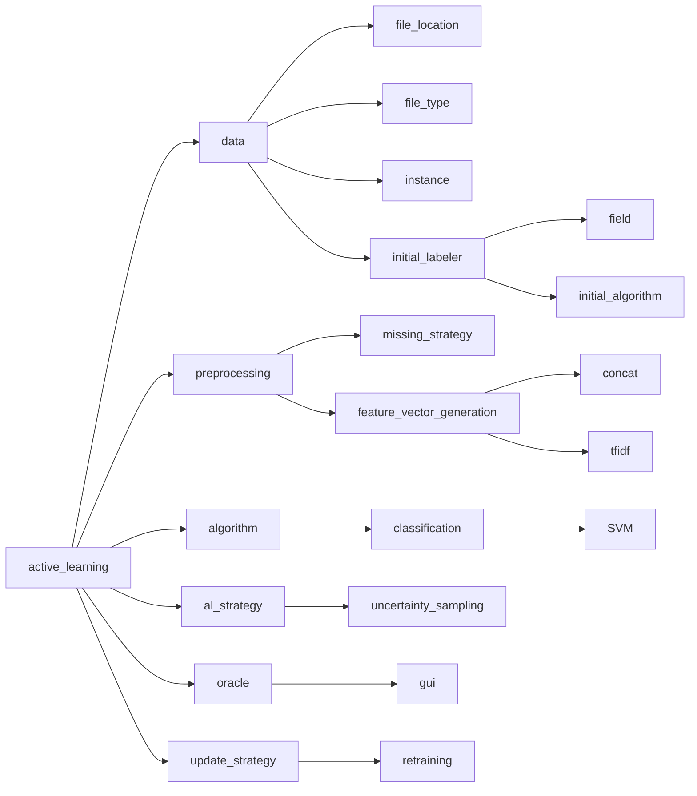

# Active learning for financial use case

Resources:

* https://github.com/RelationRx/pyrelational | https://pyrelational.readthedocs.io/en/stable/
* https://towardsdatascience.com/towards-a-fully-automated-active-learning-pipeline-29b8f4eb7d73
* https://towardsdatascience.com/how-to-build-a-fast-iterative-active-learning-data-pipeline-3c83a8838a5a

## Helper

* Data
    * Type: `["CSV"]`
    * Feature extractor:
        * `CONCAT`
        * TFIDF
    * Fields: `string`
* Initial model
    * Clustering
        * Model: `["KMeans"]`
        * Number of clusters: `["int", "best"]`
* Data labeling: `["manual"]`
    * Type `manual`: `["GUI"]`
* Active learning strategy: `["uncertainty_sampling"]`
* Oracle
* Model update process: `["incremental", "retraining"]`
* Evaluation metrics: `["f1", "accuracy"]`
* Stopping criteria: `["human"]`